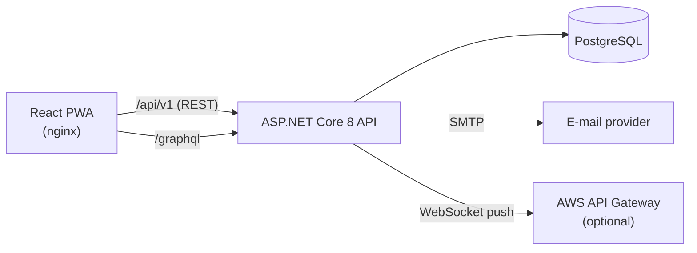

# SmartCondo

[](https://github.com/pablofelipe/SmartCondo/actions/workflows/ci.yml)
[](LICENSE)

Condominium administration platform that simplifies user management, communication between residents and administrators, and hierarchical permission control.

## Overview

SmartCondo is a full-stack application for managing residential condominiums. A condominium administrator registers towers, apartments, residents and vehicles; residents exchange messages with the administration and receive notifications. Access is governed by a hierarchical role model (system administrator → condominium administrator → resident and staff roles), enforced on every endpoint.

The project is organized as a monorepo:

```text
SmartCondo/
├── backend/               # ASP.NET Core 8 REST + GraphQL API
│   ├── src/SmartCondoApi/
│   ├── tests/SmartCondoApi.Tests/
│   └── SmartCondo.sln
├── frontend/              # React 19 + TypeScript PWA
├── docs/                  # Architecture, ADRs, diagrams and API reference
├── docker/                # Dockerfiles and nginx configuration
├── .github/workflows/     # CI pipeline
└── docker-compose.yml     # Full local environment (API + frontend + PostgreSQL)
```

## Features

- **Authentication** — JWT-based login with ASP.NET Core Identity; password reset flow with e-mailed, expiring tokens
- **Hierarchical permissions** — capability/scope/relationship-based authorization for system administrators, condominium administrators, residents and staff (see `docs/adr/0005` onward)
- **Condominium management** — CRUD for condominiums, towers, apartments and user profiles
- **Vehicle registry** — resident vehicle management exposed through a GraphQL endpoint (queries, mutations, filtering)
- **Messaging** — direct messages between residents and administration, with read tracking
- **Notifications** — real-time notification delivery through WebSocket connections (AWS API Gateway)
- **Dashboard** — aggregated statistics for administrators

## Architecture



- The API exposes **REST** endpoints (versioned under `/api/v1`) for most resources and a **GraphQL** endpoint (HotChocolate) for vehicle queries and mutations.
- Persistence uses **Entity Framework Core** with **PostgreSQL**; schema changes are tracked as EF Core migrations and applied through a key-protected migration endpoint, which also seeds roles and the initial administrator account.
- The API can run as a regular container/host or as an **AWS Lambda** function behind API Gateway (`LambdaEntryPoint`).
- All configuration (database, JWT signing key, SMTP, CORS origins) comes from **environment variables** — see [.env.example](.env.example).

More detail in [docs/architecture](docs/architecture/overview.md), decision records in [docs/adr](docs/adr), and API reference in [docs/api](docs/api/rest-api.md).

## Tech stack

| Layer | Technologies |
|---|---|
| Backend | .NET 8, ASP.NET Core, Entity Framework Core 9, HotChocolate (GraphQL), ASP.NET Core Identity, JWT, Swagger |
| Database | PostgreSQL 16 |
| Frontend | React 19, TypeScript, Apollo Client, React Router, CRA (PWA template) |
| Tests | MSTest, Moq, EF Core InMemory |
| Infrastructure | Docker, docker-compose, nginx, GitHub Actions, AWS Lambda (optional deployment target) |

## Running locally

### With Docker (recommended)

Requires Docker and Docker Compose.

```bash
cp .env.example .env       # then edit the values (at minimum DB_PASSWORD and JWT_KEY)
docker compose up --build
```

| Service | URL |
|---|---|
| Frontend | http://localhost:3000 |
| API | http://localhost:5000 |
| Swagger | http://localhost:5000/swagger |
| GraphQL | http://localhost:5000/graphql |
| PostgreSQL | localhost:5432 |

Generate a valid JWT key with:

```bash
openssl rand -base64 32
```

After the containers are up, apply migrations and seed the initial data (uses `MIGRATION_AUTH_KEY`, `ADMIN_EMAIL` and `ADMIN_PASSWORD` from your `.env`):

```bash
curl -X POST http://localhost:5000/api/v1/migration/migrate \
  -H "X-Migration-Auth: <your MIGRATION_AUTH_KEY>"
```

Then sign in on the frontend with `ADMIN_EMAIL` / `ADMIN_PASSWORD`.

### Without Docker

See the [backend README](backend/README.md) and the [frontend README](frontend/README.md).

## Running tests

```bash
cd backend
dotnet test SmartCondo.sln
```

The suite covers authentication flows, messaging, user registration rules and supporting services, using an in-memory database and mocked dependencies.

## Roadmap

- [ ] Frontend component tests
- [ ] Integration tests against a real PostgreSQL instance (Testcontainers)
- [ ] Booking of shared spaces (party hall, barbecue area)
- [ ] Visitor pre-registration and gate access log
- [ ] Billing: condominium fee tracking and delinquency reports

## License

Licensed under the [Apache License 2.0](LICENSE).
