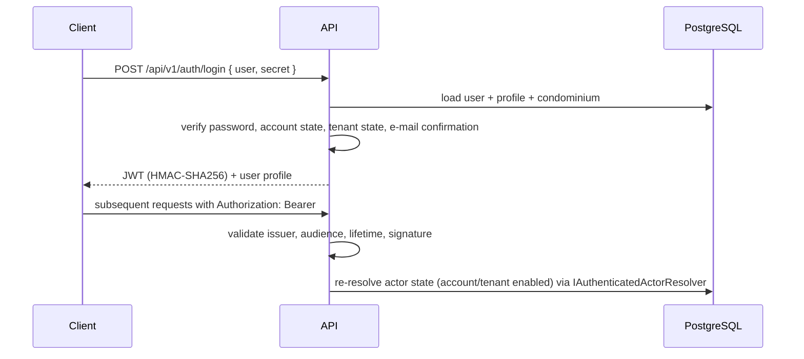

# Architecture overview

## System context

SmartCondo is a client–server application with three deployable units: a React PWA, an ASP.NET Core API and a PostgreSQL database. See [`docs/diagrams/architecture.mmd`](../diagrams/architecture.mmd) for the component diagram (canonical — not duplicated here to avoid the two copies drifting apart).

## Backend layering

Requests flow through a thin controller layer into domain services:

```text
Controller → Service (business rules) → SmartCondoContext (EF Core) → PostgreSQL
```

- **Controllers** (`Controllers/`) validate the request shape and translate domain exceptions (`Exceptions/`) into HTTP status codes; `ErrorHandlingMiddleware` is the final safety net.
- **Services** (`Services/`, one folder per domain: Auth, User, Condominium, Message, Vehicle, Email, Notification, ForgotPassword, LinkGenerator) contain the business logic and are wired through constructor injection.
- **Data** — EF Core entities in `Models/`, schema history in `Migrations/`.
- **Authorization** — a shared kernel, not per-service logic: `Models/Permissions/ResourceAuthorization` composes Capability (`RolePermissions`), Scope and Relationship against an `AuthenticatedActor` resolved fresh per request by `Infra/IAuthenticatedActorResolver`. See `docs/adr/0005` through `0010` for the full domain model and its evolution.

## Authentication and authorization



- Identity manages users and password hashing. Roles are not modeled through Identity's role store — the JWT carries the role as a plain claim (sourced from `UserType.Name`), and `Models/Permissions/RolePermissions.cs` is the single source of truth for what each role can do; it models the hierarchy *system administrator → condominium administrator → resident/staff*.
- The JWT signing key is provided via the `JWT_KEY` environment variable (base64, ≥ 32 bytes decoded) — never stored in the repository.
- Account and tenant state (`User.Enabled`, `Condominium.Enabled`) are checked both at login and on every subsequent authenticated request (`Infra/IAuthenticatedActorResolver`) — a token issued before either is disabled stops working on the very next request, not just at re-login.
- Password reset issues an expiring token (`PasswordResetToken`) delivered by e-mail; the link points at the frontend, which calls the reset endpoint.

## GraphQL

The vehicle domain is additionally exposed through HotChocolate at `/graphql` with typed queries, mutations and a filter input (`GraphQL/`). Filtering is hand-rolled LINQ against that input, not HotChocolate's built-in filtering/projection middleware (see ADR-0003). REST remains the primary protocol for the other resources; the GraphQL module demonstrates schema-first patterns on a bounded slice of the domain.

## Notifications

`WebSocketConnection` tracks connected clients. Two `INotificationService` implementations exist, selected once in DI by hosting mode (`Startup.IsLambdaHosted`), not by a runtime abstraction layer:

- **Native WebSocket** (`NativeWebSocketNotificationService`) — the default for container/Kestrel hosting (docker-compose, Azure Container Apps, AWS ECS/Fargate). Uses ASP.NET Core's built-in `UseWebSockets()` to hold connections in-process and push directly; no cloud SDK involved. The frontend connects to `/ws` (token passed as a query parameter, validated by `WebSocketTokenValidator`); nginx proxies `/ws` in the Docker setup (`docker/nginx.conf`).
- **AWS API Gateway** (`NotificationService`) — used exclusively by the Lambda-hosted mode, which cannot hold a persistent in-process connection; pushes through `IAmazonApiGatewayManagementApi.PostToConnectionAsync` instead. Requires `WebSocket:ApiUrl`.

Both share recipient resolution (`MessageRecipientResolver`) so which users get notified for a given message depends only on the message's scope, never on the delivery mechanism. See [ADR-0011](../adr/0011-container-first-cloud-agnostic-deployment.md).

## Database lifecycle

Migrations are EF Core-based. Two application paths exist:

1. `dotnet ef database update` — local development.
2. `POST /api/v1/migration/migrate` guarded by the `X-Migration-Auth` header (`MIGRATION_AUTH_KEY`), compared in constant time — applies migrations and creates the initial administrator (`ADMIN_EMAIL`/`ADMIN_PASSWORD`) if one doesn't already exist. This path exists so a serverless deployment can be migrated without shell access.

## Deployment modes

| Mode | Entry point | Notes |
|---|---|---|
| Container / host | `Program.Main` | Primary, portable path (ADR-0011). Kestrel on port 8080. Used by docker-compose locally, and by Azure Container Apps / AWS ECS-Fargate in production — same unmodified Docker image on both. Provisioned by Terraform, see [`infra/README.md`](../../infra/README.md). |
| AWS Lambda | `LambdaEntryPoint` | Secondary, non-portable mode (ADR-0011). Same application behind API Gateway; logging via Lambda logger; own DI container (`Services/Lambda/LambdaServiceProvider`). |

## Trade-offs

Decisions with real alternatives considered, consolidated here instead of scattered across ADRs:

- **Generic SMTP instead of AWS SES for outbound e-mail** — SES was the only genuine AWS runtime coupling in the email path (ADR-0011). A single portable SMTP implementation is simpler to maintain than a provider switch nobody exercises for one low-volume feature (account confirmation, password reset).
- **Native in-process WebSocket as the default, AWS API Gateway as secondary** — the container-first path (docker-compose, Azure, AWS ECS/Fargate) doesn't need a cloud SDK to hold a connection; only Lambda does, because it cannot hold one itself. Keeping both, selected by hosting mode, avoided introducing a runtime abstraction layer over a choice that's actually fixed per deployment.
- **Terraform over Bicep/CDK/SAM** — the only option that covers both Azure and AWS with one tool; using a single tool across clouds reinforces the portability claim rather than undermining it with two unrelated toolchains. Two independent root modules (`infra/azure/`, `infra/aws/`), not one cross-cloud abstraction — the providers' resource models differ enough that unifying them would only add complexity.
- **Hand-rolled GraphQL filtering instead of HotChocolate's `[UseProjection]`/`[UseFiltering]` middleware** — the authorization model has to shape the query around Capability/Scope/Relationship before any filter runs; the automatic middleware has no seam for that. See [ADR-0003](../adr/0003-graphql-for-the-vehicle-domain.md)'s amendment.

**Deliberately out of scope:**
- **Kubernetes** — the portability claim is proven at the container-image level (one Docker image on two clouds' managed-container services); an orchestrator is a separate concern not exercised by this project.
- **Prometheus/Grafana or any metrics/tracing stack** — not present. Observability today is structured logging only (`ILogger`, correlation ID per request).
- **Asynchronous messaging (queues, event bus)** — the codebase has no message broker; notifications and e-mail are synchronous calls from the request path.
- **CI/CD automation of the deploy** — the near-term goal is a documented, reproducible *manual* path under 30 minutes (ADR-0011), not push-button automation.
- **Additional cloud providers (GCP, etc.)** — only Azure and AWS are validated targets, by design.

## Configuration

All secrets and environment-specific values are environment variables (see [.env.example](../../.env.example)). `appsettings.json` contains only empty placeholders and non-sensitive defaults; `Startup` assembles the connection string from `DB_*` variables at boot.
