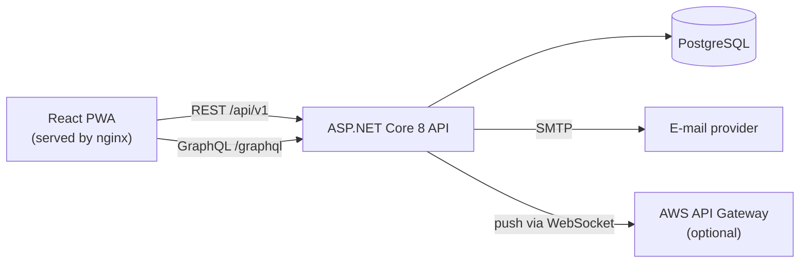
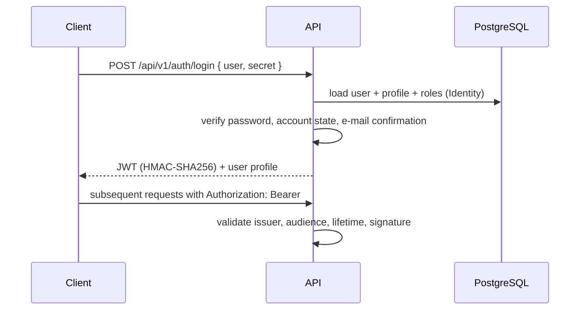

# Architecture overview

## System context

SmartCondo is a client–server application with three deployable units: a React PWA, an ASP.NET Core API and a PostgreSQL database.



## Backend layering

Requests flow through a thin controller layer into domain services:

```text
Controller → Service (business rules) → SmartCondoContext (EF Core) → PostgreSQL
```

- **Controllers** (`Controllers/`) validate the request shape and translate domain exceptions (`Exceptions/`) into HTTP status codes; `ErrorHandlingMiddleware` is the final safety net.
- **Services** (`Services/`, one folder per domain: Auth, User, Condominium, Message, Vehicle, Email, Notification, Permissions, Crypto, ForgotPassword, LinkGenerator) contain the business logic and are wired through constructor injection.
- **Data** — EF Core entities in `Models/`, schema history in `Migrations/`.

## Authentication and authorization



- Identity manages users, roles and password hashing; roles model the hierarchy *system administrator → condominium administrator → resident/staff*.
- The JWT signing key is provided via the `JWT_KEY` environment variable (base64, ≥ 32 bytes decoded) — never stored in the repository.
- Password reset issues an expiring token (`PasswordResetToken`) delivered by e-mail; the link points at the frontend, which calls the reset endpoint.

## GraphQL

The vehicle domain is additionally exposed through HotChocolate at `/graphql` with typed queries, mutations, filter inputs and projections (`GraphQL/`). REST remains the primary protocol for the other resources; the GraphQL module demonstrates schema-first patterns on a bounded slice of the domain.

## Notifications

`WebSocketConnection` tracks connected clients; `NotificationService` pushes messages through **AWS API Gateway Management API** when a WebSocket endpoint is configured (`WebSocket:ApiUrl`). Without it, the platform still works — notifications degrade to in-app polling of messages.

## Database lifecycle

Migrations are EF Core-based. Two application paths exist:

1. `dotnet ef database update` — local development.
2. `POST /api/v1/migration/migrate` guarded by the `X-Migration-Auth` header (`MIGRATION_AUTH_KEY`) — applies migrations, seeds the role hierarchy and creates the initial administrator (`ADMIN_EMAIL`/`ADMIN_PASSWORD`). This path exists so a serverless deployment can be migrated without shell access.

## Deployment modes

| Mode | Entry point | Notes |
|---|---|---|
| Container / host | `Program.Main` | Used by docker-compose; Kestrel on port 8080 |
| AWS Lambda | `LambdaEntryPoint` | Same application behind API Gateway; logging via Lambda logger |

## Configuration

All secrets and environment-specific values are environment variables (see [.env.example](../../.env.example)). `appsettings.json` contains only empty placeholders and non-sensitive defaults; `Startup` assembles the connection string from `DB_*` variables at boot.
